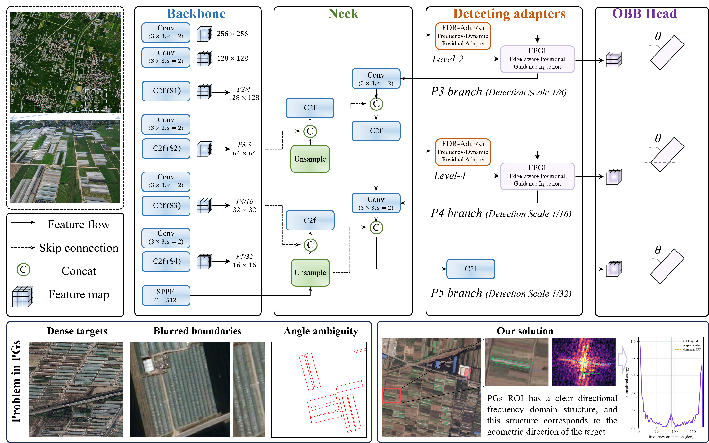
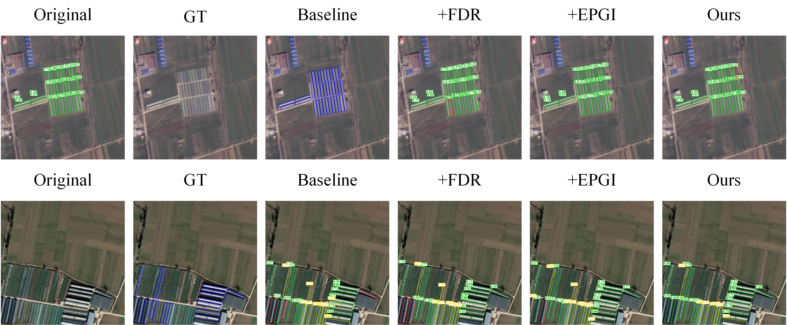

# FDPG-RDet

Official research implementation of **Frequency-Dynamic and Position-Guided Rotated Detection for Multitemporal Object-Level Mapping of Plastic Greenhouses**.

FDPG-RDet is an oriented-object detector designed for the elongated geometry, dense arrangement, repetitive roof texture, and arbitrary orientation of plastic greenhouses in high-resolution remote-sensing imagery. It augments a YOLOv8s-OBB detector with two task-specific components:

- **FDR-Adapter**: a Frequency-Dynamic Residual Adapter that strengthens direction-sensitive and periodic greenhouse features.
- **EPGI**: an Edge-aware Positional Guidance Injection module that restores shallow boundary and positional cues for more accurate oriented-box localization.

This repository contains the complete Ultralytics 8.3.221 source architecture used by the project, together with the FDPG-RDet integration and runnable training, validation, and prediction entry points.

> **Release status:** training, validation, and prediction code is available. Model weights and the dataset are not stored in this repository.

## Architecture



The FDR-Adapter and EPGI modules are inserted into the P3 and P4 detection branches, while the standard three-scale OBB head operates on P3, P4, and P5 features.

## Main results

Evaluation on the plastic-greenhouse OBB dataset used in the manuscript produced the following results:

| Precision (%) | Recall (%) | F1-score (%) | mAP<sub>50</sub> (%) | mAP<sub>50-95</sub> (%) |
| ---: | ---: | ---: | ---: | ---: |
| 86.06 | 84.37 | 85.20 | 91.41 | 71.53 |

### Qualitative comparison


### Ablation study



## Repository layout

```text
FDPG-RDet/
├── assets/                         # Selected manuscript figures
├── configs/
│   └── greenhouse-obb.example.yaml # Dataset configuration template
├── fdpg_runtime/                   # FDPG runtime modules
├── pyarmor_runtime_000000/         # Runtime libraries
├── scripts/
│   ├── train.py
│   ├── val.py
│   ├── predict.py
│   └── smoke_test.py
├── ultralytics/                    # Complete Ultralytics source package
│   ├── cfg/models/v8/
│   │   └── yolov8s-fdpg-rdet-obb.yaml
│   ├── engine/
│   ├── models/
│   ├── nn/
│   └── utils/
├── pyproject.toml
└── LICENSE
```

## Installation

The current runtime supports **Python 3.11** on **Windows x86_64** and **Linux x86_64**.

```bash
git clone https://github.com/RS-Hong/FDPG-RDet.git
cd FDPG-RDet

conda create -n fdpg-rdet python=3.11 -y
conda activate fdpg-rdet
pip install -e .
```

Verify the installation:

```bash
python scripts/smoke_test.py
```

The included source tree is based on Ultralytics 8.3.221.

## Dataset

The dataset follows the Ultralytics YOLO oriented-bounding-box format:

```text
FDPG-Greenhouse-OBB/
├── images/
│   ├── train/
│   ├── val/
│   └── test/
└── labels/
    ├── train/
    ├── val/
    └── test/
```

Each label row contains a class index followed by four normalized corner coordinates:

```text
class_id x1 y1 x2 y2 x3 y3 x4 y4
```

Copy `configs/greenhouse-obb.example.yaml` to `configs/greenhouse-obb.yaml` and replace its `path` with the absolute dataset directory.

### Dataset download

> **Dataset link:** `[To be added]`
>
> **Access code:** `[To be added, if required]`

## Training

The default options reproduce the main manuscript setup: 512 x 512 input, AdamW, 300 maximum epochs, early-stopping patience of 60, and random seed 42.

```bash
python scripts/train.py \
  --data configs/greenhouse-obb.yaml \
  --device 0 \
  --batch 32 \
  --epochs 300
```

Training outputs are written to `runs/train/` and are ignored by Git.

## Validation

Weights are not included. Supply a locally trained or separately downloaded checkpoint:

```bash
python scripts/val.py \
  --weights /path/to/best.pt \
  --data configs/greenhouse-obb.yaml \
  --split test \
  --device 0
```

## Prediction

```bash
python scripts/predict.py \
  --weights /path/to/best.pt \
  --source /path/to/images \
  --conf 0.40 \
  --iou 0.60 \
  --device 0 \
  --save-txt
```

Predicted oriented boxes and optional text labels are written to `runs/predict/`.

## Acknowledgements

This project uses [Ultralytics](https://github.com/ultralytics/ultralytics) as its detection framework. Please also comply with the licenses and citation requirements of all upstream dependencies.

## Contact

For questions, please open a GitHub issue in this repository.
